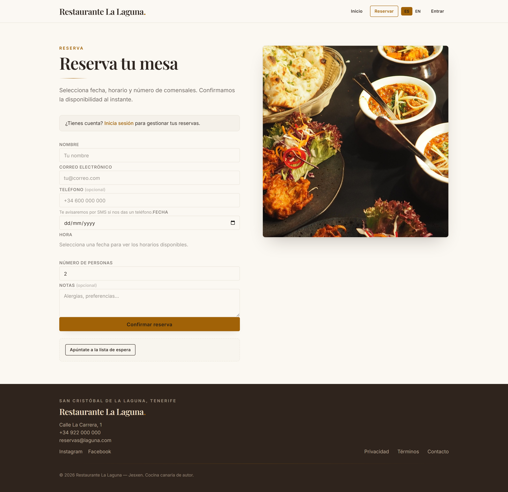
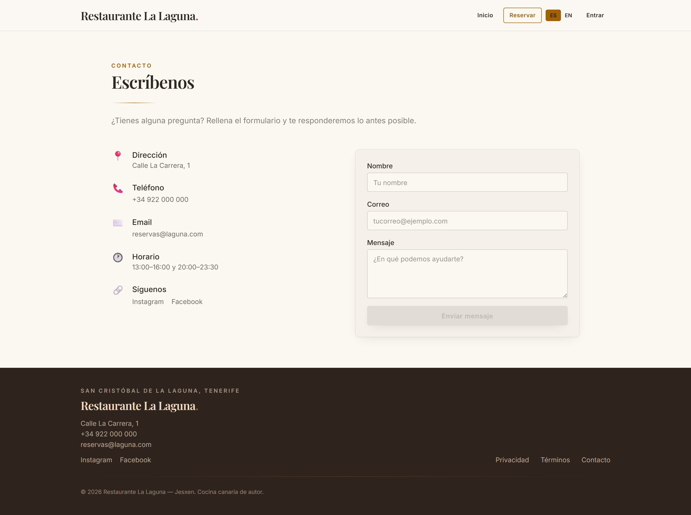
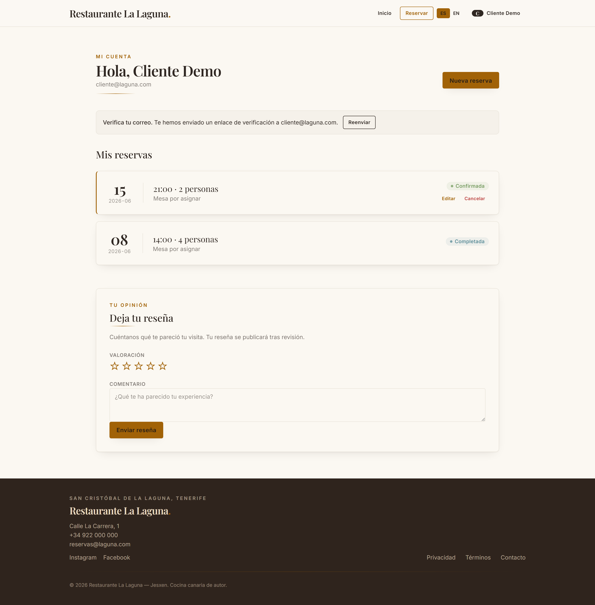
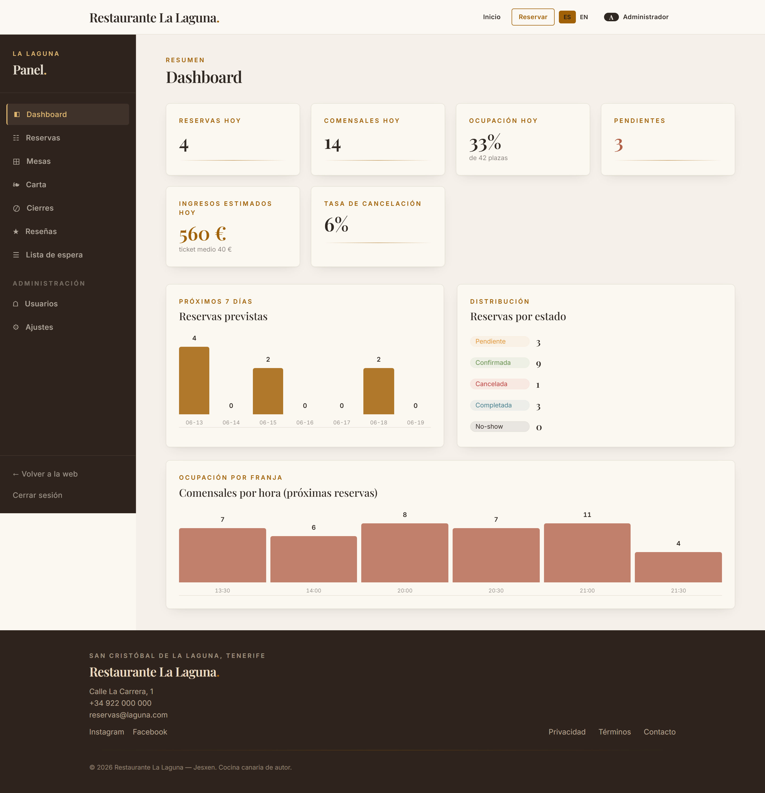
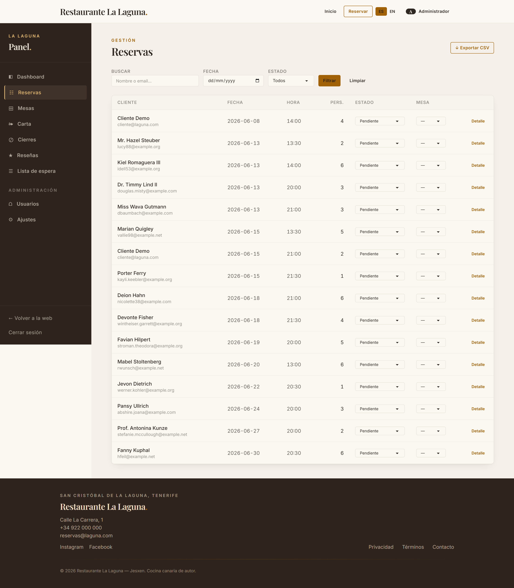
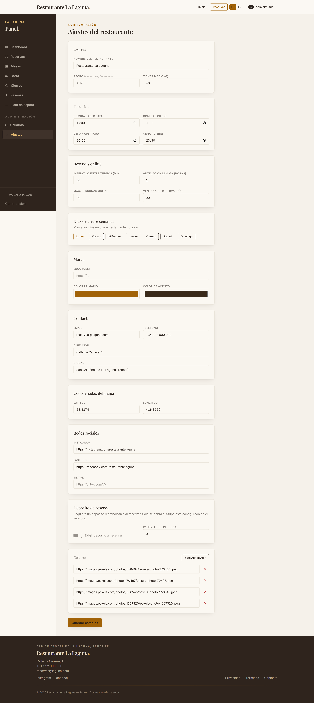
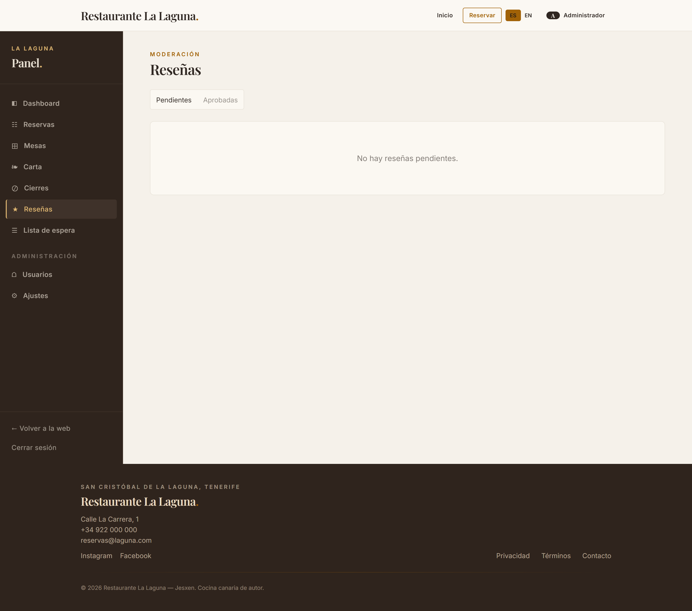
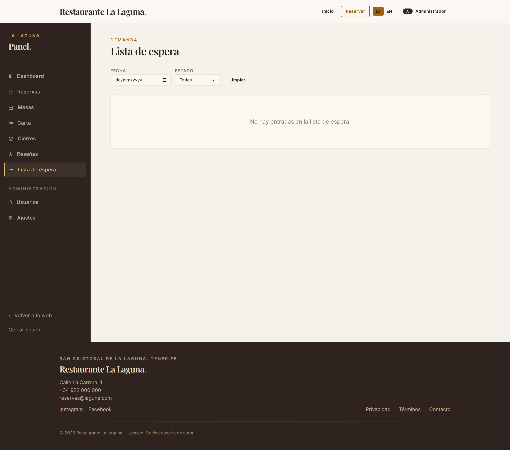

# Restaurante La Laguna — Plataforma de reservas

Full-stack restaurant reservation platform: public landing page, client portal and admin
dashboard. Rebuilt from a legacy PHP/Blade demo into a modern, decoupled architecture.

| Layer    | Stack                                                                 |
|----------|-----------------------------------------------------------------------|
| Backend  | Laravel 13 · REST API · Sanctum (token auth) · MySQL 8                 |
| Frontend | Angular 21 · standalone · signals · Tailwind v4 · DaisyUI 5 · Leaflet  |

## Features

- **Landing page** — hero, dynamic menu, gallery, location map (Leaflet) — all driven by editable settings.
- **Auth + roles** — register/login (Sanctum Bearer tokens), `client`/`staff`/`admin` roles, **password recovery** (forgot/reset) and email verification.
- **Reservations** — guest or authenticated; lifecycle `pendiente → confirmada → completada / cancelada / no_show`; unique booking reference (*localizador*).
- **Discrete time slots** — bookable slots generated from the configured service windows + interval; the client picks a slot, never a free-form time.
- **Availability** — turno-overlap-aware anti-overbooking: a booking occupies `[hora, hora+duración)` and seats are validated against every overlapping reservation in that window.
- **Booking rules** — service-hours, booking window (today…+N days), min lead time, max online party size, weekly closed days and one-off **blackout dates**.
- **Client portal** (`/cuenta`) — view, **edit** (date/slot/party/notes) and cancel own reservations; editing a confirmed booking re-queues it for confirmation.
- **Emails** — confirmation + status-change notices to the customer, new-booking alert to the restaurant, and a scheduled day-before reminder command.
- **Admin panel** (`/admin`) — KPI dashboard, reservation management (filter/search, change status, assign table), table/menu/user CRUD, blackout-date manager, review moderation, waitlist view, and a fully customizable **settings** panel (branding/colors, contact, social, map coords, slot config, gallery, closed days, deposit).
- **Reviews** — clients with a completed reservation can leave a rating + comment; admin-moderated before they appear on the landing page (with aggregate score).
- **Waitlist** — when a slot is full, guests can join the waitlist and are notified (email + optional SMS) the moment a matching table frees up.
- **Deposits (Stripe)** — optional per-person deposit collected at booking via Stripe (Payment Element + webhook); disabled gracefully when not configured.
- **SMS (Twilio)** — confirmation, reminder and waitlist notices by SMS when a phone is provided; silently skipped when not configured.
- **Multi-language** — runtime ES/EN switch across the public site, booking and auth flows.
- **Security** — per-route rate limiting, security headers, strong password policy, strict mass-assignment whitelisting, locked CORS origin, policy-based authorization. Backend covered by a 50-test PHPUnit feature suite.

## Screenshots

| Home | Reservar | Contacto |
|------|----------|----------|
|  |  |  |

| Mi cuenta | Admin · Dashboard | Admin · Reservas |
|-----------|-------------------|------------------|
|  |  |  |

| Admin · Ajustes (customization) | Admin · Reseñas | Admin · Lista de espera |
|---------------------------------|-----------------|-------------------------|
|  |  |  |

> Screenshots are generated with Playwright against the running app:
> `node frontend/tools/screenshots.mjs` (outputs to `docs/screenshots/`).

## Architecture

```
restaurant-reservations/
├── backend/    Laravel 13 API  (http://localhost:8000)
└── frontend/   Angular 21 SPA  (http://localhost:4200)
```

The Angular SPA calls the Laravel API over JSON with a Bearer token (added by an HTTP
interceptor). CORS is restricted to the frontend origin (`FRONTEND_URL` in `backend/.env`).

### Demo accounts (seeded)

| Role   | Email               | Password   |
|--------|---------------------|------------|
| Admin  | `admin@laguna.com`  | `password` |
| Client | `cliente@laguna.com`| `password` |

### API overview

Public: `POST /api/register`, `POST /api/login`, `POST /api/forgot-password`,
`POST /api/reset-password`, `GET /api/menu`, `GET /api/settings`,
`GET /api/disponibilidad?fecha&hora`, `GET /api/horarios?fecha`, `POST /api/reservas`,
`POST /api/contacto`, `GET /api/reviews`, `POST /api/waitlist`, `POST /api/stripe/webhook`.

Authenticated (`Bearer`): `GET /api/me`, `POST /api/logout`,
`POST /api/email/verification-notification`, `GET /api/mis-reservas`,
`PATCH /api/reservas/{id}` (edit), `PATCH /api/reservas/{id}/cancelar`,
`POST /api/reviews`, `GET /api/mis-esperas`.

Admin (`Bearer` + staff/admin): `GET /api/admin/dashboard`,
`GET/PATCH /api/admin/reservas`, `GET /api/admin/reservas/export`,
`apiResource /api/admin/{mesas,categorias,platos,usuarios,blackout-dates}`,
`GET/PATCH /api/admin/settings`, `GET/PATCH/DELETE /api/admin/reviews`,
`GET/DELETE /api/admin/waitlist`.

Reservation reminders: `php artisan reservas:recordatorios` (scheduled daily).

Optional integrations (set in `backend/.env`): Stripe deposits
(`STRIPE_KEY`, `STRIPE_SECRET`, `STRIPE_WEBHOOK_SECRET`) and Twilio SMS
(`TWILIO_SID`, `TWILIO_AUTH_TOKEN`, `TWILIO_FROM`). Both degrade gracefully when unset.

## Setup

### Database
```sql
CREATE DATABASE restaurante CHARACTER SET utf8mb4 COLLATE utf8mb4_unicode_ci;
```

### Backend
```bash
cd backend
composer install
cp .env.example .env        # set DB_* and FRONTEND_URL
php artisan key:generate
php artisan migrate --seed
php artisan serve            # http://localhost:8000
```

### Frontend
```bash
cd frontend
npm install --legacy-peer-deps
npm start                    # http://localhost:4200
```

> If npm fails with `UNABLE_TO_VERIFY_LEAF_SIGNATURE`, your network is intercepting TLS
> (antivirus/proxy). Point Node at the proxy root CA:
> `setx NODE_EXTRA_CA_CERTS "C:\path\to\root-ca.pem"`.

## Production build (frontend)
```bash
cd frontend
npm run build                # outputs to dist/frontend/browser
```

© Restaurante La Laguna — Jesxen
